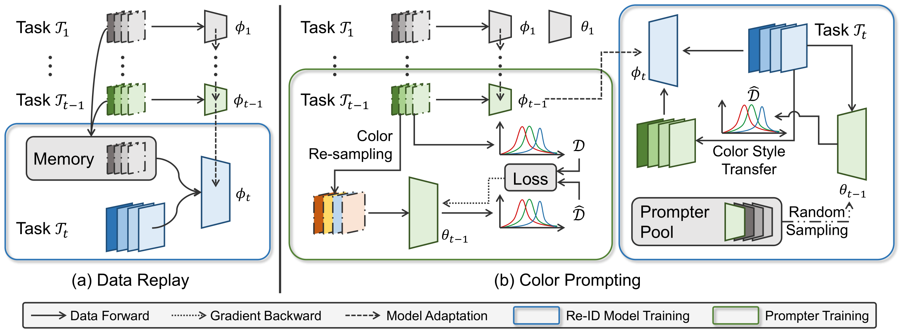

# Color Prompting for Data-Free Continual UDA Person Re-ID

Official implementation of "[Color Prompting for Data-Free Continual Unsupervised Domain Adaptive Person Re-Identification](https://arxiv.org/abs/2308.10716)". 



## Highlight :sparkles:

- We propose a Color Prompting (CoP) method for for data-free continual unsupervised domain adaptive person Re-ID. 
- CoP employs a color style transfer process to rehearse the information of previous tasks without storing the data. 
- The proposed CoP achieves 6.7% and 8.1% average rank-1 improvements over the replay method on seen and unseen domains, respectively.

## Datasets

Put the datasets into `../data`. 

- [Market-1501](https://zheng-lab.cecs.anu.edu.au/Project/project_reid.html)
- [CUHK-SYSU](http://www.ee.cuhk.edu.hk/~xgwang/PS/dataset.html)
- [MSMT17](https://www.pkuvmc.com/dataset.html)
- [CUHK02](https://www.ee.cuhk.edu.hk/~xgwang/CUHK_identification.html)
- [CUHK03](https://www.kaggle.com/datasets/priyanagda/cuhk03?resource=download)
- [GRID](https://personal.ie.cuhk.edu.hk/~ccloy/downloads_qmul_underground_reid.html)
- [iLIDS](https://xiatian-zhu.github.io/downloads_qmul_iLIDS-VID_ReID_dataset.html)

## Experiment Commands

Pre-train the model on the source domain. 

```bash
sh scripts/pretrain_market.sh
```

Conduct single domain adaptation. 

```bash
sh scripts/single_continual.sh
```

Conduct multiple domain adpatation. 

```bash
sh scripts/multi_continual.sh
```

## Citation

If you find this work helpful, please cite:

```
@article{gu2023color,
  title={Color Prompting for Data-Free Continual Unsupervised Domain Adaptive Person Re-Identification},
  author={Gu, Jianyang and Luo, Hao and Wang, Kai and Jiang, Wei and You, Yang and Zhao, Jian},
  journal={arXiv preprint arXiv:2308.10716},
  year={2023}
}
```
